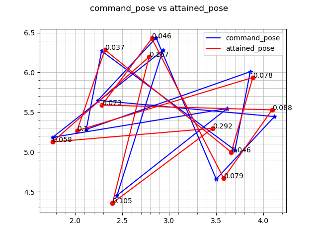
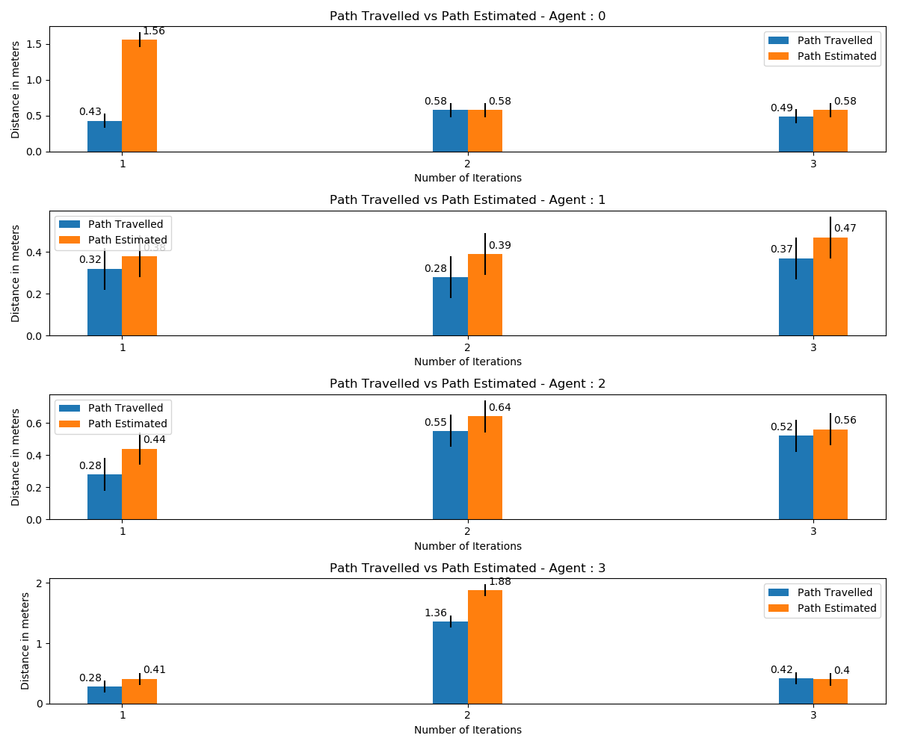

# multirobot_observers
Observer stack with multiple observers for the multi-robot fleet monitoring.
## Documentation

## 1.[localization_error_observer](localization_error_observer/README.md)
## 2.[formation_error_observer](formation_error_observer/README.md)
## 3.[power_usage_observer](power_usage_observer/README.md)
## 4.[mileage_observer](mileage_observer/README.md)

## To Launch all observers
```
ros2 launch multirobot_observer observers.launch.py

```
## To Launch all plotters
```
ros2 launch multirobot_observer plotter.launch.py

```
## Results
Formation error observer plot

Mileage observer plot

Power plot
