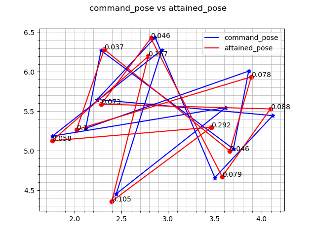
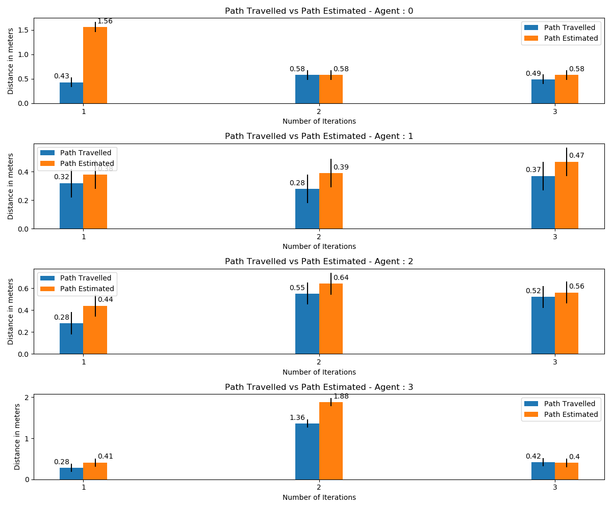
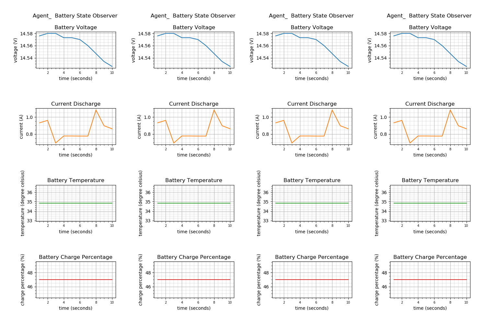

# multirobot_observers
Observer stack with multiple observers for the multi-robot fleet monitoring.
## Documentation

## 1.[localization_error_observer](localization_error_observer/README.md)
## 2.[formation_error_observer](formation_error_observer/README.md)
## 3.[power_usage_observer](power_usage_observer/README.md)
## 4.[mileage_observer](mileage_observer/README.md)

## To run the simulation 
```
ros2 launch multirobot_bringup multirobot_bringup.launch.xml

```
## To run the agents
```
ros2 run multirobot_formation agent_formation <Number of agents>
```

## To launch all observers
```
ros2 launch multirobot_observer observers.launch.py iterations:=<Number of iterations> agents:=<Number of agents>

```
Note: Power Usage Observer does not work on simulation
## To launch all plotters
```
ros2 launch multirobot_observer plotter.launch.py

```
## Results
Formation error observer plot


Mileage observer plot


Power usage observer plot
