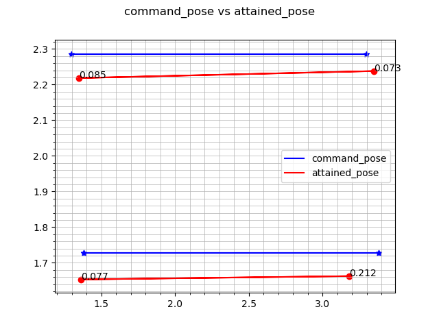

# formation_error_observer
This package is used to observe the error between the command pose (pose the agents supposed to reach) and the attained pose (pose the agents actually reach). The command poses are obtained from the topic "/barista_agent-id/send_pose" and attained poses are obtained from the topic "/barista_agent-id/amcl_pose".

## To run the simulation 
```
ros2 launch multirobot_bringup multirobot_bringup.launch.xml

```
## To run the agents
```
ros2 run multirobot_formation agent_formation <Number of agents>
```

## Start the observers

```
ros2 run formation_error_observer main <Number of iterations> <Number of agents>

```

## Generate Graph visualizations

```
ros2 run formation_error_observer formation_observer_plotter

```

Json and CSV files and graphs can be found in "<workspace>/src/multirobot_observers/formation_error_observer/data" folder

## Results

