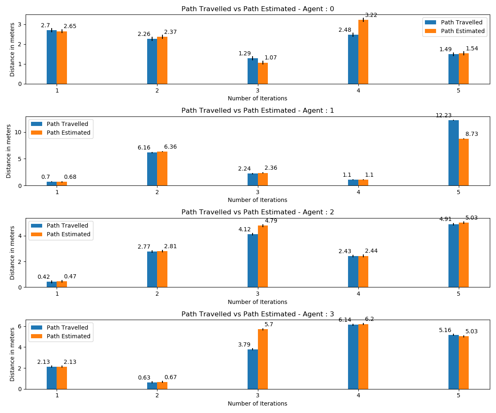

# mileage_observer
## Launching observers

```
ros2 run mileage_observer main [No. of iterations] [No. of bots]

```
## Generate visualizations 
```
ros2 run mileage_observer mileage_observer_plotter

```

Json and CSV files and graphs can be found in "<workspace>/src/multirobot_observers/mileage_observer/data" folder

## Results
images
